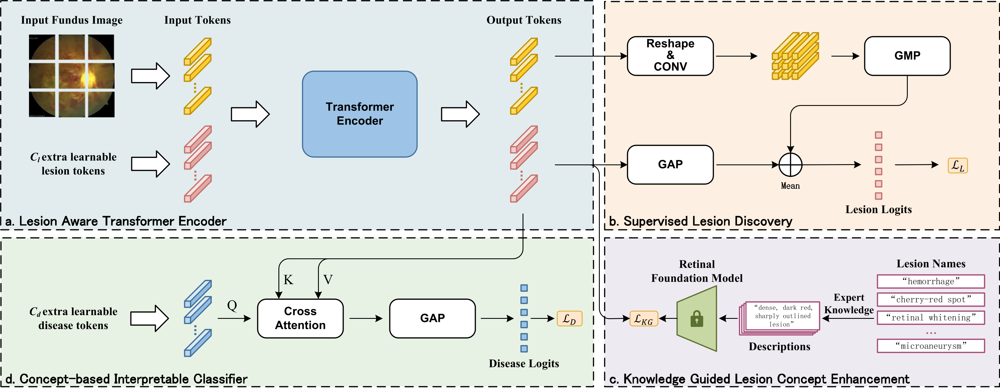

# CLAT
Official implementation of CLAT: Concept-based Lesion Aware Transformer for Interpretable Retinal Disease Diagnosis (TMI, 2024)



## Usage

### Installation

Recommended environment:

- python 3.9.7
- pytorch 2.0.1
- torchvision 0.15.2
- lightning 2.1.0

To install the dependencies, run:

```bash
git clone https://github.com/Sorades/CLAT.git
cd CLAT
# if you are using pixi
pixi i && pixi shell
# or conda:
conda env create -f environment && conda activate CLAT
# or pip:
pip install -r requirements.txt
```

### Dataset

- [FGADR Dataset](https://csyizhou.github.io/FGADR/)
- [DDR Dataset](https://github.com/nkicsl/DDR-dataset)

The annotation files are placed at `./data`

### Preprocess
Refer to `src/preprocess` for the implementation for image preprocessing.

_**!!Please note** that the lesion label simply indicates the presence or absence of the corresponding lesion. In our experiments, lesion labels for DDR and FGADR are determined by the existence of a mask._

### Training and Testing

Modify the settings in `./configs/default.yaml`,  and then run the commands below to train and test the model:

```bash
python src/main.py fit_and_test --config configs/default.yaml --data configs/data/FGADDR.yaml

# test with automatic intervention
python src/main.py exp_int --config configs/default.yaml --data configs/data/FGADDR.yaml
```

### Log
By default, `Tensorboard` is used to log metrics and heatmaps.
```bash
tensorboard --logdir <INPUT_YOUR_LOG_DIR> --bind_all
```
Run the command and open the url (usually http://\<IP\>:6006) to access the dashboard.

## Citation

```bib
@article{wen2024concept,
  title={Concept-based Lesion Aware Transformer for Interpretable Retinal Disease Diagnosis},
  author={Wen, Chi and Ye, Mang and Li, He and Chen, Ting and Xiao, Xuan},
  journal={IEEE Transactions on Medical Imaging},
  year={2024},
  publisher={IEEE},
  doi={10.1109/TMI.2024.3429148}
}
```

